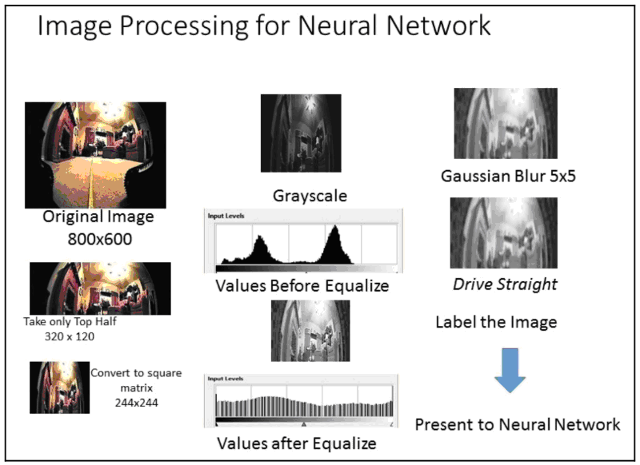
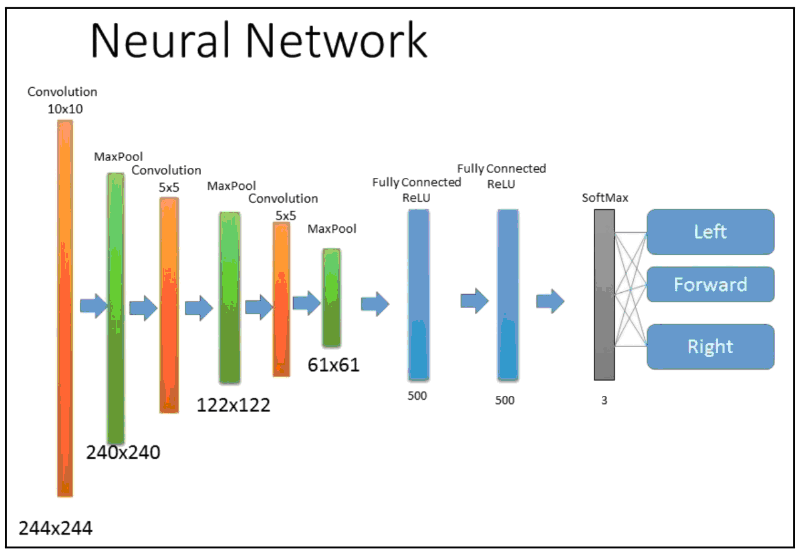

# 7.6 Обработка изображения

На этом этапе нам нужно сделать несколько шагов, прежде чем мы сможем предоставить наши данные нейронной сети для обучения. Камера на роботе имеет слишком большое разрешение для нейросети, кроме того, требуется использовать минимальное количество данных в ней.

Первый шаг состоит в том, чтобы уменьшить размер изображения до 320x200. Мы разрезаем изображение пополам и оставляем только верхнюю половину, что исключает пол из нашего рассмотрения. Затем изменяем размер прямоугольного изображения до 244x244, что является подходящим размером для обработки нейронной сетью. После этого преобразуем изображение в черно-белое, чтобы у нас был только один канал для обработки.

Следующим шагом выравниваем изображение, взяв весь диапазон возможных значений. Необработанные выходные данные камеры не содержат ни чистого белого \(255\), ни чистого черного \(0\). Самое низкое значение может быть 53, а самое высокое-180 для диапазона 127. Мы масштабируем значения оттенков серого, вычитая минимум \(53\) и умножая на масштабный коэффициент \(127/255\). Это расширяет диапазон изображения до полного масштаба и устраняет многие вариации в освещении, которые могут существовать. Так мы пытаемся предоставить непротиворечивые данные в нейронную сеть.

После этого нужно выполнить функцию размытия по Гауссу для данных. Требуется уменьшить некоторые высокочастотные данные в изображении, чтобы сгладить некоторые края. Это необязательный шаг, и он может быть не нужен в некоторых средах. У нас же есть много деталей в поле зрения робота, и размытие даст нам лучшие результаты. Размытие также заполнит некоторые пробелы в гистограмме оттенков серого, оставленные процессом выравнивания на нашем предыдущем шаге \(который можно увидеть на диаграмме\).

Далее нужно нормализовать данные, чтобы уменьшить масштаб с 0-255 до 0-1. Это делается для того, чтобы удовлетворить входным требованиям искусственной нейронной сети. Для выполнения этой операции мы просто делим каждый пиксель на 255 и преобразуем данные из формата изображения OpenCV в массив NumPy.

Наша нейронная сеть представляет собой девятислойную сверточную нейронную сеть, очень похожую на детектор игрушек/не игрушек, который мы делали в прошлых главах. Однако в нашем последнем шаге вместо двоичных выходных данных, определяемых двоичным классификатором, будем использовать классификатор Softmax с тремя выходами – прямое движение, левый или правый поворот. Также можно сделать больше категорий, если захотим, и иметь легкие и жесткие повороты, а не только один уровень поворотов. Мы могли бы даже добавить категорию "резервное копирование", но сначала давайте попробуем использовать простую модель и получить три выхода. Следует помнить, что количество выходных категорий должно точно соответствовать меткам нашей обучающей выборки.

Итак, нейросеть имеет девять слоев. Первые шесть – это пары сверточных сетей с максимальными слоями объединения между ними. Это позволяет сети иметь дело с постепенно увеличивающейся детализацией изображения. Последние два слоя полностью связаны с активациями ReLU \(Rectifier Linear Units\). ReLU принимает только положительные значения от других слоев. Наш последний слой – это классификатор Softmax с тремя выходами:

Как и в любых других задачах обучения нейронной сети, мы должны разделить входные данные на обучающие выборки и выборки проверки. Будем использовать 80% наших данных для обучения и 20% для валидации. Использовать процесс, который дублирует изображения со случайными вращениями – как это было с программой распознавания игрушек, поскольку мы не просто распознаем изображения, но и используем их для направления. Смена ротации могла бы испортить направления движения.

